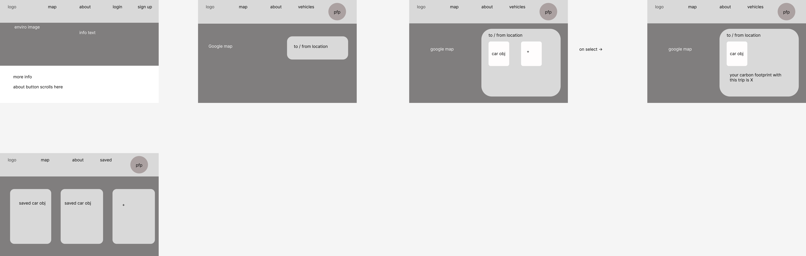

# HAILEY GARCIA CAPSTONE PROJECT README

# Carbon Calc

## Table of Contents
1. [Overview](#Overview)
1. [Product Spec](#Product-Spec)
1. [Wireframes](#Wireframes)
1. [Schema](#Schema)

## Overview
### Description
Core: Users can enter their cars miles per gallon and their view their trip + trip distance using Google Maps SDK. There, their carbon footprint is calculated. Their different cars are stored on the backend so they can login and reuse the same car.

Stretch: User can save different trips they plan on taking

### App Evaluation
- **Category:** Educational
- **Mobile:** This app would be primarily developed for web applications and work optimally on laptop/desktops but it would still work on mobile devices.
- **Story:** Provides users with a mapping tool to look at their carbon footprint with driving trips they normally take.
- **Market:** This is primarilly geared towards Gen-Z and Milenials but anyone could use it.
- **Habit:** This application would not be a daily use application, rather users would look at it when they are curious about their carbon footprint.
- **Scope:** At it's core, the application is just providing information about how driving is impacting the environment.
## Product Spec
### 1. User Stories (Required and Optional)

**Required Must-have Stories**

* User logs in to create & save car objects with car name & MPG.
* User can open a mapping tool where they can look up trips they normally take on google maps.
* From that page, the carbon footprint pops up
* Saved cars page
* About page -> more info about carbon crisis

**Optional Nice-to-have Stories**

* Saved trips to look at easily again.

### 2. Screen Archetypes

* Login
* Register - User signs up or logs into their account
* Mapping screen - Google map where they can look up a trip, with sidenav bar to pick a car object to calculate carbon footprint
* Profile Screen
   * Allows user to upload a photo and put in their information
* About Screen
   * More info about carbon crisis.

### 3. Navigation

**NavBar Navigation - on open**
* About
* Map
* Login
* Sign up

**NavBar Navigation - logged in**
* About
* Map
* Vehicles
* Profile

**Flow Navigation**
* Forced Log-in -> Account creation if no log in is available
* Map -> Opens Map
* Vehicles -> user vehicles

## Wireframes
 

### [BONUS] Digital Wireframes & Mockups

## Schema
### Models
#### User
   | Property      | Type     | Description |
   | ------------- | -------- | ------------|
   | userName      | String   | unique id for the username |
   | password      | String   | passwords for each user |
   | vehicle      | vehicle   | vehicle object for each car the user has |
   | carName      | String   | vehicle name |
   | milesPerGallon | Float   | miles per gallon that specific vehicle gets |

### Networking
#### List of network requests by screen
   - Vehicles (or Maps) Screen
      - (Create/POST) Create a vehicle object (w/ carName - String and milesPerGallon - float )
      - (Delete) Delete existing vehicle
   - Profile Screen
      - (Read/GET) Query logged in user object
      - (Update/PUT) Update user profile images
#### [OPTIONAL:] Existing API Endpoints

##### Google Maps API
